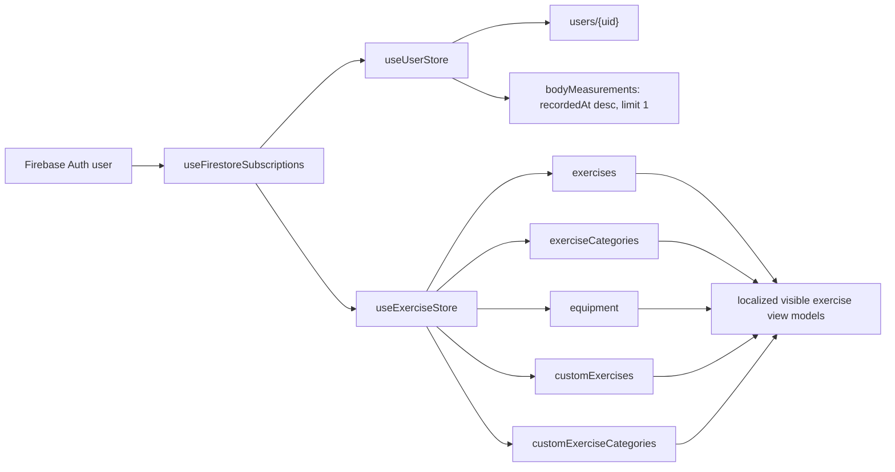

# Firestore schema diagram

This is the visual companion to [`db-structure.md`](db-structure.md). It shows the same nine
collections, embedded shapes, and full-reference relationships. Firestore has no foreign keys; `FK`
below means a convention validated by the runtime boundary, not a server-enforced join.

## Collection hierarchy

```text
exerciseCategories/{slug}                  global, authenticated read only
equipment/{slug}                           global, authenticated read only
exercises/{slug}                           global, authenticated read only

users/{uid}
|-- customExerciseCategories/{id}          owner scoped
|-- customExercises/{id}                   owner scoped
|-- workoutTemplates/{id}                  owner scoped, not accessed by the current app
|-- workouts/{id}                          owner scoped, not accessed by the current app
`-- bodyMeasurements/{id}                  owner scoped, append-only in the current UI
```

## Documents and references

```mermaid
erDiagram
    users {
        string uid PK "Firebase Auth UID"
        string firstName
        string lastName
        string displayName
        string email "nullable"
        string photoURL "nullable"
        Body body "embedded map"
        string purpose "nullable"
        UserSettings settings "embedded map"
        number schemaVersion
        Timestamp createdAt
        Timestamp updatedAt
    }

    Body {
        string birthDate "nullable, YYYY-MM-DD"
        number heightCm "nullable"
    }

    UserSettings {
        string theme "light, dark, system"
        string language "en, uk"
        string units "metric, imperial"
        string[] hiddenExerciseRefs "full Refs"
        string[] hiddenCategoryRefs "full Refs"
    }

    exerciseCategories {
        string slug PK "deterministic document ID"
        GlobalLocalizedText name "embedded map"
        number order
        string icon
        boolean isRetired
    }

    equipment {
        string slug PK "deterministic document ID"
        GlobalLocalizedText name "embedded map"
        string icon "nullable"
        boolean isRetired
    }

    exercises {
        string slug PK "deterministic document ID"
        string categoryRef FK "global category Ref"
        GlobalLocalizedText name "embedded map"
        GlobalLocalizedText description "embedded map"
        ExerciseType type "strength, cardio, bodyweight"
        string[] equipment "global equipment Refs"
        string imageURL "nullable"
        boolean isRetired
    }

    GlobalLocalizedText {
        string en "required by decoder"
        string uk "seeded, optional to decoder"
    }

    customExerciseCategories {
        string categoryId PK "user-scoped document ID"
        UserLocalizedText name "embedded map"
        string defaultLocale "en or uk"
        number order
        string icon "nullable"
        boolean isArchived
        Timestamp createdAt
        Timestamp updatedAt
    }

    customExercises {
        string exerciseId PK "user-scoped document ID"
        string categoryRef FK "global or custom category Ref"
        string forkedFromRef FK "nullable global exercise Ref"
        UserLocalizedText name "embedded map"
        UserLocalizedText description "embedded map"
        string defaultLocale "en or uk"
        ExerciseType type
        string[] equipment "global equipment Refs"
        string imageURL "nullable"
        Timestamp createdAt
        Timestamp updatedAt
    }

    UserLocalizedText {
        string en "optional"
        string uk "optional"
    }

    workoutTemplates {
        string templateId PK "user-scoped document ID"
        string name
        string description "nullable"
        TemplateExercise exercises "embedded array"
        number estimatedDuration "nullable, minutes"
        boolean isArchived
        Timestamp lastPerformedAt "nullable"
        number timesPerformed
        Timestamp createdAt
        Timestamp updatedAt
    }

    TemplateExercise {
        string exerciseRef FK "global or custom exercise Ref"
        string nameSnapshot
        ExerciseType type
        TemplateSet sets "embedded array"
    }

    TemplateSet {
        number weight "optional, kg"
        number reps "optional"
        number duration "optional, seconds"
        number distance "optional, meters"
    }

    workouts {
        string workoutId PK "user-scoped document ID"
        string templateRef FK "nullable custom template Ref"
        string templateName "nullable snapshot"
        WorkoutStatus status "in_progress, completed, abandoned"
        Timestamp startedAt
        Timestamp completedAt "nullable"
        number activeSeconds "nullable"
        string localDate "YYYY-MM-DD"
        string timeZone "IANA zone"
        number bodyweightKg "nullable"
        string notes "nullable"
        WorkoutExercise exercises "embedded array"
        Timestamp createdAt
        Timestamp updatedAt
    }

    WorkoutExercise {
        string exerciseRef FK "global or custom exercise Ref"
        string nameSnapshot
        ExerciseType type
        WorkoutSet sets "embedded array"
    }

    WorkoutSet {
        boolean isCompleted
        number weight "optional, kg"
        number reps "optional"
        number duration "optional, seconds"
        number distance "optional, meters"
        number rpe "optional, 1-10"
        string notes "optional"
    }

    bodyMeasurements {
        string measurementId PK "auto ID from current writer"
        Timestamp recordedAt
        number weightKg
        string note "optional"
    }

    users ||--|| Body : "embeds"
    users ||--|| UserSettings : "embeds"
    users ||--o{ customExerciseCategories : "owns"
    users ||--o{ customExercises : "owns"
    users ||--o{ workoutTemplates : "owns"
    users ||--o{ workouts : "owns"
    users ||--o{ bodyMeasurements : "owns"

    exerciseCategories ||--|| GlobalLocalizedText : "localized name"
    equipment ||--|| GlobalLocalizedText : "localized name"
    exercises ||--|| GlobalLocalizedText : "localized name and description"
    customExerciseCategories ||--|| UserLocalizedText : "localized name"
    customExercises ||--|| UserLocalizedText : "localized name and description"

    exerciseCategories ||--o{ exercises : "categoryRef"
    exerciseCategories ||--o{ customExercises : "global categoryRef"
    customExerciseCategories ||--o{ customExercises : "custom categoryRef"
    exercises ||--o| customExercises : "forkedFromRef alias"
    equipment }o--o{ exercises : "equipment refs"
    equipment }o--o{ customExercises : "equipment refs"

    workoutTemplates ||--o{ TemplateExercise : "embeds"
    TemplateExercise ||--o{ TemplateSet : "embeds"
    exercises ||--o{ TemplateExercise : "global exerciseRef"
    customExercises ||--o{ TemplateExercise : "custom exerciseRef"

    workoutTemplates ||--o{ workouts : "templateRef"
    workouts ||--o{ WorkoutExercise : "embeds"
    WorkoutExercise ||--o{ WorkoutSet : "embeds"
    exercises ||--o{ WorkoutExercise : "global exerciseRef"
    customExercises ||--o{ WorkoutExercise : "custom exerciseRef"
```

## Listener graph

Two domain stores are started centrally after authentication. They own seven Firestore snapshot
listeners in total.



The exercise store also watches the Zustand user store so language and hidden-ref changes recompute
the merged catalogue without adding a sixth Firestore listener. Workout and workout-template schemas
remain in the diagram, but the current client has no listeners for those collections.
